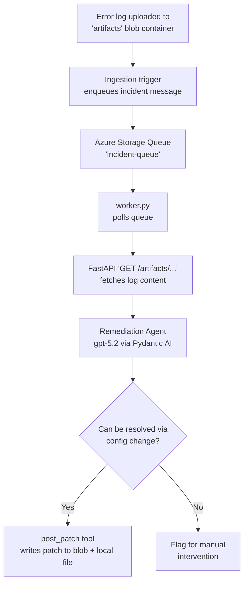

# Incident Agent Workflow

An autonomous incident remediation pipeline that detects error logs, analyzes them against system configuration using an AI agent (via [Pydantic AI](https://ai.pydantic.dev/)), and either generates a configuration patch automatically or escalates the incident for manual review.

## Overview



The system is split into three cooperating pieces:

1. **Ingestion** — an Azure Function (see [.github/agents/incident-ingestion-agent.agent.md](.github/agents/incident-ingestion-agent.agent.md)) watches the `artifacts` blob container for new log files and posts a message to `incident-queue`.
2. **API service** ([app/main.py](app/main.py)) — a FastAPI app that exposes artifact and configuration blobs to the worker.
3. **Worker + Agent** ([worker.py](worker.py), [app/agents/agent.py](app/agents/agent.py)) — polls the queue, fetches the log via the API, and runs it through an AI agent that diagnoses the issue and either proposes a patch or flags it for human review.

## Repository Structure

```
app/
  main.py                 FastAPI application entrypoint
  routers/
    artifacts.py           GET /artifacts/{path} - serves blob content
  agents/
    agent.py                Remediation agent (Diagnosis, PatchRemediation, OutPutResult)
  dependancies/
    tools.py                  Tools class - Azure Blob Storage helpers (artifacts, config, patches)
worker.py                  Queue consumer that drives the agent for each incident
setup_test_data.py         Seeds Azurite with sample logs + system config for local testing
test_queue.py              Async helper to push sample incident messages onto the queue
docker-compose.yml         Azurite (Azure Storage emulator) service definition
mock_blob_storage/         Local blob storage artifacts (emulator-backed)
mock_infrasettings_storage/
  app_config.json          Sample system configuration (thresholds, versions, limits)
mock_patches/               Local copies of patches generated by the agent
.github/agents/
  incident-ingestion-agent.agent.md  Spec for the .NET blob-trigger ingestion function
```

### Agent Output Schema

```python
class OutPutResult(BaseModel):
    incident_id: str
    manual_intervention_needed: bool
    diagnosis: Diagnosis            # summary, root_cause
    requires_patch: bool
    patchRemediation: PatchRemediation  # patch_summary, patch_path
```

> **Note:** `manual_intervention_needed` is currently produced by the agent but is not yet wired up to a real notification/ticketing system — see [Known Limitations](#known-limitations).

## Prerequisites

- Python **3.14+**
- [uv](https://docs.astral.sh/uv/) (or `pip`) for dependency management
- Docker (or [Colima](https://github.com/abiquo/colima) on macOS) for running Azurite
- An OpenAI API key (the agent uses `openai:gpt-5.2` via Pydantic AI)

## Setup

### 1. Install dependencies

```bash
uv sync
```

### 2. Configure environment variables

Create a `.env` file in the project root:

```env
OPENAI_API_KEY=your-openai-key

# Azure Storage Queue / Blob (Azurite defaults shown)
AZURE_STORAGE_CONNECTION_STRING=DefaultEndpointsProtocol=http;AccountName=devstoreaccount1;AccountKey=<azurite-dev-key>;BlobEndpoint=http://127.0.0.1:10500/devstoreaccount1;QueueEndpoint=http://127.0.0.1:10501/devstoreaccount1;TableEndpoint=http://127.0.0.1:10502/devstoreaccount1;
QUEUE_CONNECTION_STRING=DefaultEndpointsProtocol=http;AccountName=devstoreaccount1;AccountKey=<azurite-dev-key>;QueueEndpoint=http://127.0.0.1:10501/devstoreaccount1;
QUEUE_NAME=incident-queue
QUEUE_VISIBILITY_TIMEOUT=300
QUEUE_MIN_BACKOFF=1
QUEUE_MAX_BACKOFF=60
QUEUE_BACKOFF_FACTOR=2

FASTAPI_URL=http://localhost:8000
```

> The Azurite well-known development account key can be found in the [Azurite documentation](https://learn.microsoft.com/azure/storage/common/storage-use-azurite). Never use this key or connection string against a real Azure Storage account.

### 3. Start Azurite (local Azure Storage emulator)

```bash
docker-compose up -d
```

This starts Azurite with:
| Service | Port |
|---|---|
| Blob | 10500 |
| Queue | 10501 |
| Table | 10502 |

### 4. Seed local test data

```bash
python setup_test_data.py   # uploads sample logs + config to Azurite
python test_queue.py        # pushes incident_123 / incident_124 onto the queue
```

This uploads sample error logs and the system configuration to Azurite and pushes sample incident messages directly onto the queue — no deployment required, fully offline, and the fastest way to iterate on the worker/agent logic. See [End-to-End Integration](#end-to-end-integration) for exercising the full pipeline instead.

### 5. Start the FastAPI service

```bash
fastapi dev app/main.py
```

### 6. Start the worker

```bash
python worker.py
```

Watch `app.log` (or the worker terminal) to see the agent process the incident, and check the `patches` container / `mock_patches/` directory for generated remediation patches.

## End-to-End Integration

Use this workflow when you want to validate the full pipeline (blob trigger → queue → worker → agent) instead of the worker/agent portion in isolation.

Deploy the [IncidentWorkflowAzureFunction](https://github.com/dinushika93/IncidentWorkflowAzureFunction) and point it at the same storage account (Azurite locally, or a real Azure Storage account for staging). Uploading a log file to the `artifacts` container then triggers the function, which generates the `incident_id` and enqueues the message itself — the same path production will use.

## Blob Containers

| Container | Purpose |
|---|---|
| `artifacts` | Raw error log files fetched by the worker via the FastAPI service |
| `infrastructure-settings` | System configuration (`app_config.json`) used by the agent to evaluate fixes |
| `patches` | Configuration patches generated by the agent |

## Dependencies

- **Azure Function (blob-watcher)** — external repo that monitors the `artifacts` blob container and enqueues incident messages onto `incident-queue`: [IncidentWorkflowAzureFunction](https://github.com/dinushika93/IncidentWorkflowAzureFunction)


## Testing Utilities

- [test_queue.py](test_queue.py) — async script to create the queue (if needed) and push sample incident messages.
- [setup_test_data.py](setup_test_data.py) — seeds sample logs and configuration into blob storage for an end-to-end local test.